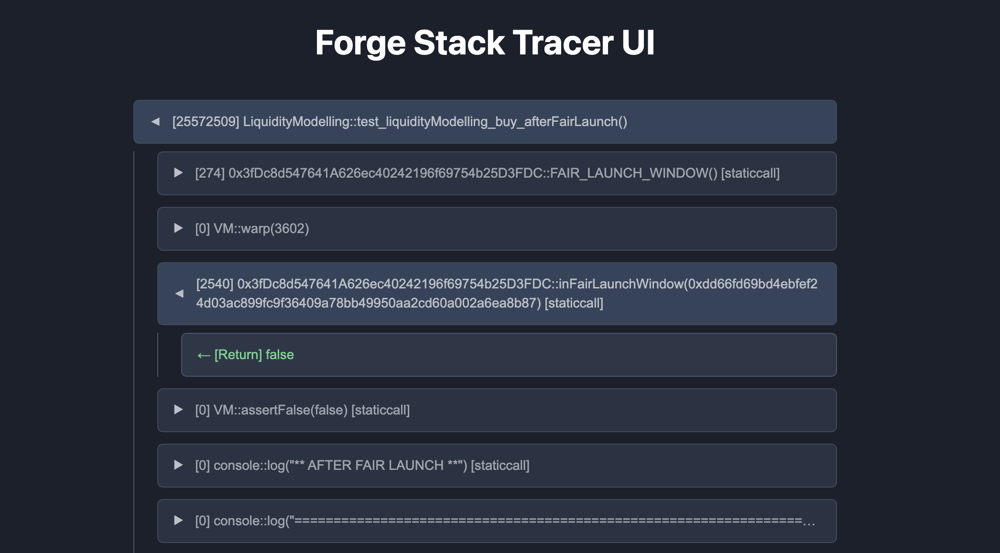

# forge-stack-tracer

CLI tool that converts your Foundry test output into interactive stack traces!

## Usage

Simply pipe the forge tests result into `fst`.

```
forge test --mt test_case -vvvv | fst
```



## Installation

```
npm i -g forge-stack-tracer
```

## Output

The package generates a static html file in your current foundry project, at: `./out/_fst/fst-{timestamp}.html`

## Options

You can also pass an extra argument to specify the output html file name & path:

```
forge test --mt test_case -vvvv | fst temp/fst.html
```

## Development

### Install Dependencies

```
pnpm i
```

### Overview

1. `./src/` contains the react code, which gets compiled into a single html file: `dist/index.html`.
2. This html file acts as a template.
3. `src/bin/index.ts` script allows to use this template and generate new static html files for any given foundry tests output.

### Running locally

1. `pnpm run build` to build into `dist` folder
2. Install the package locally: `npm install -g .`
3. Make the script executeable: `chmod +x dist/index.js` (have to do it each time after build)
